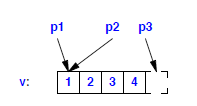

# The C++ Programming Language by Bjarne Stroustrup

---

# Part I: Introductory Material

## 1. Notes to the Reader
## 2. A Tour of C++: The Basics
## 3. A Tour of C++: Abstraction Mechanisms
## 4. A Tour of C++: Containers and Algorithms
## 5. A Tour of C++: Concurrency and Utilities

# Part II: Basic Facilities

## 6. Types and Declarations
## 7. Pointers, Arrays, and References
## 8. Structures, Unions, and Enumerations
## 9. Statements
## 10. Expressions
## 11. Select Operations
## 12. Functions
## 13. Exception Handling
## 14. Namespaces
## 15. Source Files and Programs

# Part III: Abstraction Mechanisms

## 16. Classes
## 17. Construction, Cleanup, Copy, and Move
## 18. Operator Overloading
## 19. Special Operators
## 20. Derived Classes
## 21. Class Hierarchies
## 22. Run-Time Type Information
## 23. Templates
## 24. Generic Programming
## 25. Specialization
## 26. Instantiation
## 27. Templates and Hierarchies
## 28. Metaprogramming
## 29. A Matrix Design

# Part IV: The Standard Library

## 30. Standard Library Summary
## 31. STL Containers
## 32. STL Algorithms
## 33. STL Iterators
## 34. Memory and Resources
## 35. Utilities
## 36. Strings
## 37. Regular Expressions
## 38. I/O Streams
## 39. Locales
## 40. Numerics
## 41. Concurrency
## 42. Threads and Tasks
## 43. The C Standard Library
## 44. Compatibility

---

# Part II: Basic Facilities

---


# 6. Types and Declarations

## Character Types

There are many character sets and character set encodings in use. C++ provides a varierty of character types that reflect that - often bewildering - variety:

* **```char```:** The defualt character type, used for program text. A **```char```** is used for the implementation's character set and is usually 8 bits.
* **```signed char```:** Like **```char```**, but guaranteed to be signed, that is, capable of holding both positive and negative values.
* **```unsigned char```:** Like **```char```**, but guaranteed to be unsigned
* **```wchar_t```:** Provided to hold characters of a larger character set such as Unicode. The size of **```wchar_t```** is implementation-defined and large enough to hold the largest character set supported by the implementation's locale.
* **```char16_t```:** A type for holding 16-bit character sets, such as UTF-16
* **```char32_t```:** A type for holding 32-bit character sets, such as UTF-32.

A ```char``` variable can hold a character of the implementation's character set. For example:

```c++
char ch = 'a';
```

A ```char``` typically has 8 bits so it can hold 256 different values ( ```2^8``` ). The character set is a variant of ISO-646 ( like ASCII ).

Each character has an integer value in the character set used by the implementation. For example, the value ```'b'``` is ```98``` in the ASCII character set.

The notation ```int{c}``` gives the integer value for a character ```c``` ("the ```int``` wen can construct from ```c```"). The possibility of converting a ```char``` to an integer raises the question: is a ```char``` signed or unsigned? The 256 values represented by an 8-bit byte can be interpreted as the values ```0``` to ```255``` or as the values ```-127``` to ```127```. No, not ```-128``` to ```127``` as one might expect: The C++ standard leaves open the possiblity of one's-complement hardware and that eliminates one value; thus, a use of ```-128``` is non-portable. Unfortunately, the choice of signed or unsigned for a plain ```char``` is implementation-defined. C++ provides two types for which the answer is definite: ```signed char```, which can hold at least the values ```-127``` to ```127```, and ```unsigned char```, which can hold at least the values ```0``` to ```255```.

## Signed and Unsigned Characters

It is implementation-defined wheter a plain ```char``` is considered signed or unsigned. This opens the possiblity for some nasty surprises and implementation dependencies. For example:

```c++
char c = 255; // 255 is "all ones," hexadecimal 0xFF
int i = c;
```

What will be the value of ```i```? Unfortunately, the answer is undefined. On an implementation with 8-bit bytes, the answer depends on the meaning of the "all ones" ```char``` bit pattern when extended into an ```int```. On a machine where a ```char``` is unsigned, the answer is *255*. On a machine where a ```char``` is signed, the answer is ```-1```. In this case, the compiler might warn about the conversion of the literal ```255``` to the ```char``` value ```-1```. However, C++ does not offer a general mechanism for detecting this kind of problem. One solution is to avoid plan ```char``` and use the specific ```char``` types only. Unfortunately, some standard-library functions, such as ```strcmp()```, take plain ```char```s only.

## Character Literals

A *character literal* is a single character enclosed in single quotes, for example, ```'a'``` and ```'0'```. The type of a acharacter literal is ```char```. A character literal can be implicitly converted to its integer value in the character set of the machine on which the C++ program is to run. For example, if you are running on a machine using the ASCII character set, the value of ```'0'``` is ```48```. The use of character literals rather than decimal notation makes programs more portable.

A few characters have standard names that use the backslash, ```\```, as an escape character:

|Name|ASCII Name|C++ Name|
|----|----------|--------|
|Newline|NL(LF)|```\n```|
|Horizontal tab|HT|```\t```|
|Vertical tab|VT|```\v```|
|Backspace|BS|```\b```|
|Carriage return|CR|```\r```|
|Form feed|FF|```\f```|
|Alert|BEL|```\a```|
|Backslash|\\|```\\```|
|Question mark|?|```\?```|
|Single quote|'|```\'```|
|Double quote|"|```\"```|
|Octal number|```ooo```|```\ooo```|
|Hexadecimal number|```hhh```|```\hhh```|

## Integer types

Like ```char```, each integer type comes in three forms: "plain" ```int```, ```signed int```, and ```unsigned int```. In addition, integer come in four sizes: ```short int```, "plain" ```int```, ```long int```, and ```long long int```. A ```long int``` can be referred to as plain ```long```, and a ```long long int``` can be referred to as plain ```long long```. Similarly, ```short``` is a synonym for ```short int```, ```unsinged``` for ```unsigned int```, and ```signed``` for ```signed int```.

The ```unsigned``` integer types are ideal for uses that treat storage as a bit array. Using an ```unsigned``` instead of an ```int``` to gain one more bit to represent positive integers is almost never a good idea. Attempts to ensure that some values are positive by declaring variables ```unsigned``` will typically be defeated by the implicit conversion rules.

In addition to the standard integer types, an implementation may provide *extended integer types* (signed and unsigned). These types must behave like integers and are considered integer types when considering conversions and integer literal values, but they usually have greater range (occupy more space).

## Integer Literals

Integer literals come in three guises: decimal, octal and hexadecimal. Decimal literals are the most common used and look as you would expect them to:

```C++
7 1234 976 12345678901234567890
```

The compiler ought to warn about literals that are too long to represent, but an error is only guaranteed for ```{}``` initializers.

A literal starting with zero followed by ```x``` or ```X``` (```0x``` or ```0X```) is a hexadecimal ( base 16 ) number. A literal starting with zero but not followed by ```x``` or ```X``` is an octal ( base 8 ) number. For example:

|Decimal|Octal|Hexadecimal| is a hexadecimal ( base 16 ) number. A literal starting with zero but not followed by ```x``` or ```X``` is an octal ( base 8 ) number. For example:

|Decimal|Octal|Hexadecimal| is a hexadecimal ( base 16 ) number. A literal starting with zero but not followed by ```x``` or ```X``` is an octal ( base 8 ) number. For example:

|Decimal|Octal|Hexadecimal| is a hexadecimal ( base 16 ) number. A literal starting with zero but not followed by ```x``` or ```X``` is an octal ( base 8 ) number. For example:

|Decimal|Octal|Hexadecimal|
|-------|-----|-----------|
| |0|0x0|
|2|02|0x2|
|63|077|0x3f|
|83|0123|0x53|

The suffix ```U``` can be used to write explicitly ```unsigned``` literals. Similalry, the suffix ```L``` can be used to write explicitly ```long``` literals. For example, ```3``` is an ```int```, ```3U``` is an ```unsigned int``` and ```3L``` is a ```long int```.

Combinations of suffixes are allowed. For example:

```CPP
cout << 0xF0UL << '' << 0LU << "\n";
```

## Types of Integer Literals

In general, type type of an integer literal depends on its form, value and suffix:

* If it is decimal and has no suffix, it has the first of these types in which its value can be represented: ```int```, ```long int```, ```long long int```.
* If it is octal or hexadecimal and has no suffix, it has the first of these types in which its value can be represented: ```int```, ```unsigned int```, ```long int```, ```unsigned long int```, ```long long int```, ```unsigned long long int```.
* If it is suffixed by ```u``` or ```U```, its type is the first of these types in which its value can be represented: ```unsigned int```, ```unsigned long int```, ```unsigned long long int```.
* If it is decimal and suffixed by ```l``` or ```L```, its type is the first of these types in which its value can be represented: ```long int```, ```long long int```.
* If it is octal or hexadecimal and suffixed by ```l``` or ```L```, its type is the first of these types in which its value can be represneted: ```long int```, ```unsinged long int```, ```long long int```, ```unsigned long long int```.
* If it is suffixed by ```ul```, ```lu```, ```uL```, ```Ul```, ```UL``` or ```LU```, its type if the first of these types in which its value can be represented: ```unsinged long int```, ```unsigned long long int```.
* If it is decimal and suffixed by ```ll``` or ```LL```, its type is ```long long int```.
* If it is octal or hexadecimal and is suffixed by ```ll``` or ```LL```, its type is the first of these types in which its value can be represented: ```long long int```, ```unsigned long long int```.
* If it is suffixed by ```llu```, ```llU```, ```Ull```, ```LLu```, ```LLU```, ```uLL``` or ```ULL```, its type is ```unsigned long long int```.

## Prefixes and Suffixes

There is a minor zoo of suffixes indicating types of literals and also a few prefixes:

|Notation|*fix|Meaning|Example|
|--------|----|-------|-------|
|0|prefix|octal|0776|
|```0x```/```0X```|prefix|hexadecimal|```0xff```|
|```u```/```U```|suffix|```unsigned```|```10U```|
|```l```/```L```|suffix|```long```|```20000L```|
|```ll```/```LL```|suffix|```long long```|```20000LL```|
|```f```/```F```|suffix|```float```|```10.3f```|
|```e```/```E```|infix|```floating-point```|```10e-4```|
|```.```|infix|```floating-point```|```12.3```|
|```'```|prefix|```char```|```'c'```|
|```u'```|prefix|```char16_t```|```u'c'```|
|```U'```|prefix|```char32_t```|```U'c'```|
|```L'```|prefix|```wchar_t```|```L'c'```|
|```"```|prefix|```string```|```"mess"```|
|```R"```|prefix|raw string|```R"(\b)"```|
|```u8"```/```u8R"```|prefix|UTF-8 string|```u8"foo"```|
|```u"```/```uR"```|prefix|UTF-16 string|```u"foo"```|
|```U"```/```UR"```|prefix|UTF-32 string|```U"foo"```|
|```L"```/```LR"```|prefix|```wchar_t``` string|```L"foo"```|

## ```void```

The type ```void``` is syntactically a fundamental type. It can, however, be used ony as part of a more complicated type; there are no objects of type ```void```. It is used either to specify that a funciton does not return a value or as the base type for pointers to objects of unknown type. For example:

```CPP
void x; // error: these aer no void objects
void& r; // error: there are no references to void
void f(); // function f does not return a value
void* pv; // pointer to object of unknown type
```

## The Structure of Declarations
However, without too many radical simplifications, we can consider a declaration as having five parts ( in order ):

* Optional prefix specifiers ( e.g, ```static``` or ```virtual``` )
* A base type ( e.g, ```vector<double>``` or ```const int``` )
* A declarator optionally including a name (e.g, ```p[7]```, ```n``` or ```*(*)[]``` )
* Optional suffix function specifiers ( e.g, ```const``` or ```noexcept``` )
* An optional initializer or function body ( e.g, ```={7,5,3}``` or ```{return x;}```)

A declarator is composed of a name and optionally some declarator operators. The most common declarator operators are:

| |Declarator Operators| |
|-|--------------------|-|
|prefix|```*```|pointer|
|prefix|```*const```|constant pointer|
|prefix|```*volatile```|volatile pointer|
|prefix|```&```|lvalue reference|
|prefix|```&&```|rvalue reference|
|prefix|```auto```|function ( using suffix return type ) | 
|prefix|```[]```|array|
|prefix|```()```|function|
|prefix|```->```|returns from function|

## Declaring Multiple Names

It is possible to declare several names in a single declaration. The declaration simply contains a list of comma-separated declarators. For example, we can declarte two integers like this:

```C++
int x, y; // int x; intnt y;
```

Operators apply to individual names only - and not to any subsequent names in the same declaration. For example:

```C++
int* p,y ; // int*p; int y NOT int*y;
int x, *q; // intx; int*q;
int v[10], *pv; // int v[10]; int* pv;
```

## Scope

A declaration introduces a name into a scope; that is a name can be used only in a specific part of the program text.

* ***Local scope***: A name declareted in a function or lambda is called a *local name*. Its scope extends from its point of declaration to the end of the block in which tis declaration occurs. A *block* is a seciton of code delimited by a ```{}``` pair. Function and lambda parameter names are considered local names in a outermost block of their funciton or lambda.
* ***Clas scope***: A name is called a *member* name if it is defined in a class outside any function, lambda, class, or enum class. Its scope extends from the opening ```{``` of the class declaration to the end of the class declaration.
* ***Namespace scope***: A name is called a *namespace member name* if it is defined in a namespace outside any function, lambda, class or enum class. Its scope extends from the point of declaration to the end of its namespace. A namespace name may also be accessible from other translation units.
* ***Global scope***: A name is called a *global name* if it is defined outside any function, class, enum calss or namespace. The scope of a global name extends from the point of declaration to the end of the file in which its declaration occurs. A global name may alos be accessible from other translation units. Technically, the global namespace is considered a namespace, so a global name is an example of a namesapce member name.
* ***Statement scope***: A name is in a statement scope if it is defined within the ```()``` part of a ```for-```, ```while-```, ```if-``` or ```switch-``` statement. Its scope extends from its point of declaration to the end of its statement. All names in statement scope are local names.
* ***Function scope***: A lable is in scope throughout the body of its function.

***A declaration of a name in a block can hide a declaration in an enclosing block or a global name.*** That is, a name can be ***redefined to refer to a different entity within a block***. After exit from the block, the names resumes its previous meaning. For example:

```C++
int x; // global x

void f(){
    int x; // local x hides global x
    x = 1; // assign to local x
    {
        int x; // hides first local x
        x = 2; // assign to second local x
    }

    x = 3; // assign to first local x
}

int* p = &x; // take address of global x
```

Hiding name is unavoidable, when writing large programs. However, a huma reader can easily fail to notice that a name has been hidden ( alsk known as *shadowed* ). Because such errors are relatively rare, they can be very difficult to find. Consequently, **name hiding should be minimized**.

A hidden global name ca be referred to using ***the scope resolution operator, ```::```***. For example:

```C++
int x;

void f(){
    int x = 1; // hide global x
    ::x = 2; // assign to global x
    x = 2; // assign to local x
    //...
}
```

## Initialization

If an initializer is specified for an object, that initializer determines the initial value of an object. An initializer can use one of four syntactic styles:

```C++
X a1{v};
X a2 = {v};
X a3 = v;
X a4(v);
```

Of these, **only the first can be used every context**, and I strongly recommend its use. It is clearer and less error-prone that the alternatives.

However, ahything much more complicated than that is better done using ```{}```. Initializaiton using ```{}```, *list initialization*, does not allow narrowing. That is:

* An integer cannot be converted to another integer that cannot hold its value. For example, ```char``` to ```int``` is allowed but not ```int``` to ```char```.
* A floating-point value cannot be converted to another floating-point type that cannot hold its value. For example, ```float``` to ```double``` is allowed, but not ```double``` to ```float```.
* A floating-point vavlue cannot be converted to an integer type.
* An integer value cannot be converted to a floating-point type.

There is no advantage to using ```{}``` initialization, and one trap, when using ```auto``` to get the type determined by the initializer. The trap is that if the initializer is a ```{}```-list,w e may not want its type deduced. For example:

```C++
auto z1 {99}; // z1 is an initializer_list<int>
auto z2 = 99; // z2 is an int
```

So, prefer ```{}``` initialization over alternatives unless you have a strong reason not to.
The empty initializer list, ```{}```, is used to indicate that a default value is desired. For example:

```C++
int x4 {}; // x4 becomes 0
double d4 {}; // d4 becomes 0.0
char* p{}; // p becomes nullptr
vector<int> v4{}; // v4 becomes the empty vector
string s4{}; // s4 becomes ""
```

## Dedeucing a Type: ```auto``` and ```decltype()```

The language provides two mechanisms for deducing a type from an expression:

* ```auto``` for deducing a type of an object from its initializer; the type can be the type of a variable, a ```const```, or a ```constexpr```.
* ```decltype(expr)``` for deducing the type of something that is not a simple initializer, such as the return type for a function or the type of a class member</int>

The deduction done here is very simple: ```auto``` and ```decltype()``` simply report the type of an expression already known to the compiler.

### The ```auto``` Type Specifier

When a declaration of a variable has an initializer, we don't need to explicitly specify a type. Instead, we can let the variable have the type of its initializer. Consider:

```C++
int a1 = 123;
char a2 = 123;
auto a3 = 123; // the type of a3 is "int"
```

The type of the inger literal ```123``` is ```int```, so ```a3``` is an ```int```. That is ,```auto``` is a placeholder for the type of the initializer. Using ```auto``` instead of ```int``` for an expression as simple as ```123``` doesn't help much. The harder the type is to write and the harder the type is to know, the more useful ```auto``` becomes.

If a scope is large, mentioning a type explicitly can help localize errors. That is, compared to using a specific type, using ```auto``` can delay the deteciton of type errors. For example:

```C++
void f(complex<double> d)
{
    //...
    auto max = d + 7; // fine: max is a complex<double>
    double min = d - 9; // error: we assumed that d was a scalar
    //...
}
```

If ```auto``` causes surprises, the best cure is typically to make functions smaller, which most often is a good idea anyway.

We can decorate a deduce type with specifiers and modifiers, such as ```const``` and ```&```. For example:

```C++
void f(vector<int>& v)
{
    for(const auto& x : v){ // x is a const int&
        // ...
    }
}
```

### ```auto``` and ```{}```-lists

When we explicitly mention the type of an boject we are initializing, we have two types to consider: the type of the object and the type of the initializer> For example:

```C++
char v1 = 12345; // 12345 is an int
int v2 = 'c'; // 'c' is a char
T v3 = f();
```

By using the ```{}```-initializer syntax for such definitions, we minimize the chances for unfortunate conversions:

```C++
char v1 {12345}; // error: narrowing
int v2 = {'c'}; // fine: implicit char -> int conversion
T v3 {f()}; // works if an only if the type of () can be implicitly converted to a T
```

When we use ```auto```, there is only on tyep involved, the type of the initializer, and we can safely use the ```=``` syntax:

```C++
auto v1 = 123456; // v1 is an int
auto v2 = 'c'; // v2 is a char
auto v3 = f(); // v3 is of some appropriate type
```

In fact, it can be an advantage to use the ```=``` syntax with ```auto```, because the ```{}```-list syntax might surprise someone:

```C++
auto v1 {12345}; // v1 is a list of int
auto v2 {'c'}; // v2 is a list of char
auto v3 {f()}; // v3 is alist of some appropriate type
```

### The ```decltype()``` Specifier

We can use ```auto``` whne we have a suitable initializer. But sometimes, we want to have a type deduced without defining an initialized variable. Then, we can use a declaration type specifier: ```decltype(expr)``` is the declared type of ```expr```. This is mostly useful in generic programming

## Objects and Values

We can allocate and use objects that do not have names ( e.g, created using ```new``` ) and it is possible to assign to strange-looking expressions ( e.g, ```*p[a+10]=7``` ). Consequently, we need a name for "something in memory". This is the simplest and most fundamental notion of an object. That is, an *object* is a contiguous region of storage; an *lvalue* is an expression that refers to an object. The word "lvalue" was originally coined to mean "something that ca be on the left-hand side of an assignment". However, not every lvalue may be used on the left-hand side of an assignment; an lvalue can refer to a constant. An lvalue that has not been declared ```const``` is often called a *modifiable lvalue*. The simple and low-level notion of an object should not be confused iwth the notions of class object and object of polymorphic type.

### Lvalues and Rvalues

To complement the notion of an lvalue, we have the notion of an *rvalue*. Roughly, rvalue means "a value that is not an lvalue", suhc as a temporary value ( e.g., the value returned by a function ).

If you need to be more technical, you need a more refined view of lvalue and rvalue. There are two properties tthat matter for an object when it comes to addressing, copying and moving:

* *Has identity:* The program has the name of, pointer to, or reference to the object so that it is possible to determine if two objects are teh same, wheter the value of the object has changed, etc.
* *Is movable:* The object may be moved from (i.e, we can move its value to antoher location and leave the object in a valid but unspecified state, rather than copy )

For practical programming, thinking in terms of rvalue and lvalue is usually sufficient. note that every expression is either an lvalue or an rvalue, but not both.

## Lifetimes of Objects

The *lifetime* of an object starts when its constructor completes and ends when its destructor stars executing. Objects of types without a declared constructor, such as an ```int```, can be considered to have default constructors and desctructors that do nothing.

We can classify objects based on their lifetimes:

* ***Automatic:*** Unless the programmer specifies otherwise, an object declared in a function is created when its definitions is encountered and destroyed when its name goes out of scope. Such objects are sometimes called *automatic* objects. In a typical implementation, automatico bjects are allocated on the stack; each call of the function gets its own stack frame to hold its automatic objects.
* ***Static:*** Objects declared in glboal or namespace scope and ```static```s declared in functions or classes are created an initialized once ( only ) and "live" until the program terminates. Such objects are called *static* objects. A static object has the same address throughout the life os a program execution. Static objects can cause serious problems in a multi-threaded program becuase they are shared among all threads and typically require locking to avoid data races.
* ***Free store:*** Using the ```new``` and ```delete``` operators, we can create objevcts whose lifetimes are controlled directly.
* ***Temporary objects:*** (e.g., intermediate results in a computation or an boject used to hold a value for a reference to ```const``` argument): their lifetime is determined by their use. If they are bound to a reference, their lifetime is that of the reference; otherwise, they "live" until the end of the full expression of which tye are part. A *full expression* is an expression that is not part of another epxression. Typically, temporary objects are automatic.
* ***Thread-local*** objects that is, objects declared ```thread_local```: such objects are created when their thread is and destroyed when their thread is.

*Static* and *automatic* are traditionally referred to as *storage classes*.
Array elements are nonstatic class members have their lifetimes determined by the objects of which they are part.

## Type Aliases

Somestimes, we need a new name for a type. Possible reasons include:

* The original name is too long, complicated, or ugly.
* A programming technique requires different types to have the same name in a context.
* A specific type is mentioned in one place only to simplify maintenance.

For example:

```C++
using Pchar = char*; // pointer to character
using PF = int(*)(double); // pointer to function taking a double and returning an int
```

An older syntax using the keyword ```typedef``` and placing the name being declared where it would have been in a declaration of a variable can equivalently be used in many contexts. For example:

```C++
typedef int int32_t; // equivalent to "using int32_t = int;"
typedef short int16_t: // equivalent to "using int16_t = short;"
typedef void(*PtoF)(int); // equivalent to "using PtoF = void(*)(int);"
```

## Advice

1. For the final word of language definition issues, see the ISO C++ standard.
2. Avoid unspecifided and undefined behavior.
3. Isolate code that must depend on implenetation-defined behavior.
4. Avoid unnecessary assumptions about the numeric value of characters.
5. Remember that an integer starting with a ```0``` is octal.
6. Avoid "magic constants".
7. Avoid unnecessary assumptions about the size of integers.
8. Avoid unnecessary assumptions about the range and precision of floating-point types.
9. Prefer plain ```char``` over ```signed char``` and ```unsigned char```.
10. Beware of conversion between signed and unsigned type
11. Declare one name ( only ) per declaration.
12. Keep common and local names short, and keep uncommon and nonlocal names longer.
13. Avoid similar-looking names.
14. Name an object to reflect its meaning rather than its type.
15. Maintain a consistent naming style.
16. Avoid ```ALL_CAPS```` names.
17. Keep scopes small.
18. Don't use the same name in both a scope and an enclosing scope.
19. Prefer the ```{}```-initializer syntax for declarations with a named type.
20. Prefer the ```=``` syntax for the initialization in declarations using ```auto```
21. Avoid uninitialized variables.
22. Use an alias to define a meaningful name for a built-in type in cases in which the built-in type used to represent a value might change.
23. Use an alis to define synonyms fo rtypes; use enumerations and classes to define new types.

# 7. Pointers, Arrays, and References

## Introduction

We can refer to an object by name, but in C++ (most) object "have identity". That is, they reside at a specific address in memroy, and an object can be accessed if you know its address and its type. The language constructrs for holding and using addresses are pointers and references.

## Pointers

### Introduction

Pointers are variables that hold the address of another variable. Pointers are used to point to another variable in the memory.

A pointer that points to a variable of type ```T``` is built using ```T*``` and the compiler will allocate the same amount of memory for the pointer, as it did for the variable of the type it points to.

For example:

```C++
int a = 5;
int* p = &a;
```

If an integer gets 4 bytes allocated, the pointer ```p``` will also get 4 bytes allocated.

The notation ```&a``` returns the address of the variable ```a```.
The notation ```int*  p``` represents a pointer to an integer.

The most important operation on pointers is called *dereferencing*. This means getting the value that the pointer is pointing to:

```C++
int a = 5;
int*p = &a;
cout << *p << endl;
// Ouptut: 5
```

We will now receive 5 since we have dereferenced the pointer ```p```.

The notation ```*p``` means *dereferencing* the pointer ```p```, meaning that you receive the value that the pointer ```p``` is pointing to.

Pointers can change what value they are pointing to. A pointer can point to ```a``` and then you can change it to point to ```b``` (unless it's ```const```, we'll get to that later).

#### Book

For a Type ```T```, ```T*``` is a type "pointer to ```T```". That is, a variable of type ```T*```, can hold the address of an object of type ```T```. For example:

```C++
char c = 'a';
char* p = &c;  // p holds the address of c; & is the address-of operator
```

or graphically:


The fundamental operation of a pointer is ***dereferencing***, that is, ***refereing to the object pointed to by the pointer***. This operation is also called *indirection*. The dereferencing operator is (prefix) unary ```*```. For example:

```C++
char c = 'a';
char* p = &c;  // p holds the address of c; & is the address-of operator
char c2 = *p;  // c2 == 'a'; * is the dereference operator
```

The object pointed to by ```p``` is ```c```, and the value stored in ```c``` is ```'a'```, so the value of ```*p``` assigned to ```c2``` is ```'a'```.


The ```*```, meaning "pointer to", is used as a suffix for a type name. Unfortunately, pointers to arrays and pointers to functions need a more complicated notation:

```C++
int* pi; // pointer to int
char** ppc; // pointer to pointer to char
int* ap[15]; // array of 15 pointers to ints
int (*fp)(char*); // pointer to function taking a char* argument; returns an int
int* f(char*); // function taking a char* argument, returns a pointer to int
```

## ```void*```

The ```void*``` type is used when we don't know the type of the object that a pointer is pointing to. You can convert any type of pointer to a ```void*``` pointer, however, you can't convert a ```void*``` poitner to any type.

#### Book

In low-level code, we occasionally need to store or pass along an address of a memory location without actually knownig what type of object is stored there. A ```void*``` is used for that. ***You can read ```void*``` as "pointer to an object of unkonwn type".***

***A pointer to any type of object can be assigned to a variable of type ```void*```,*** but a pointer to function or a pointer to member cannot. In addition, a ```void*``` can be assigend to another ```void*```, ```void*```s can be compared for equality and inequality, and a ```void*``` cna be explicitly converted to another type. Other operations would be unsafe because the compiler cannot konw hwat kind of object is really pointed to. Consequently, other operations result in compile-time errors. To use a ```void*```, we must explicitly convert it to a pointer to a specific type. For example:

```C++
void f(int* pi) {
    void* pv = pi; // ok: implicit conversion of int* to void*
    *pv; // error: can't dereference void
    ++pv; // error: can't increment void* (the size of the object pointed to is unknown)

    int* pi2 = static_cast<int*>(pv); // explicit conversion back to int*

    double* pd1 = pv; // error
    double* pd1 = pi; // error
    double* pd3 = static_cast<double*>(pv) // unsafe
}
```

***It is not safe to use a pointer that has been converted ("cast") to a type that differes from the type of the object pointed to***. For example, a machine may assume that every ```double``` is alllocated on a 8-byte boundary. If so, strange behavior could arise if ```pi``` pointer to an ```int``` that wasn't allocated that way. This form of explicit type conversion is inherently unsafe and ugly. Consequently, the notation used, ```static_cast```, was designed to be ugly and easy to find in code.

***The primary use for void\**** is for passing pointers to function that are not allowed to make assumptions about the type of the object and for returning untyped objcects from functions. To use such an object, we must use explicit type conversion.

***Functions using ```void*``` pointer typically exist at the very lowest level of the system***, where real hardware resources are manipulated. For example:

```C++
void* my_alloc(size_t n);  // allocate n bytes from my special heap
```

***Occurrences of ```void*```s at higher levels of the system should be viewed with great suspicion because they are likely indicators of design errors.*** Where used for optimization, ```void*``` can be hidden behind a type-safe interface.

Pointers to functions and pointers to memmbers cannot be assigned to ```void*```s.

## ```nullptr```

The ```nullptr``` value is assigned to pointers that don't yet point to anything.
For example:

```C++
int* a = nullptr;
```

#### Book

The literal ```nullptr``` represents the null pointer, that is, ***a pointer that does not point to an object***. It can be assigned to any pointer type, but not to other built-in types:

```C++
int* pi = nullptr;
double* pd = nullptr;
int i = nullptr; // error: i is not a pointer
```

***There is just one ```nullptr```,*** which can be used for every pointer type, rather than a null pointer for each pointer type.

## Arrays

### Introduction

In order to build an array in C++ you use the following notation:

```C++
T array[size];
```

where ```T``` is the type of elements that are accepted inside the array. Example:

```C++
int array[5];
```

if the compiler allocates 4 bytes for an ```int```, then it will allocated 20 bytes for an array of 5 integers.

#### Book

***For a type ```T```, ```T[size]``` is the type "array of ```size``` elements of type ```T```".*** The elements are indexed from ```0``` to ```size-1```. For example:

```C++
float v[3]; // an array of three floats: v[0], v[1], v[2]
char* a[32]; // an array of 32 pointers to char: a[0]...a[31]
```

You can access an array using the subscript operator, ```[]```, or through a pointer (using operator ```*``` or operator ```[]```). For example:

```C++
void f() {
    int aa[10];
    aa[6] = 9; // assigns to aa's 7th element
    int x = aa[99]; // undefined behavior
}
```

***Access out of range of an array is undefined and usually disastrous.*** In particular, run-time range checking is neither guaranteed nor common.

***An array is C++'s fundamental way of representing a sequence of objects in memory***. If what you want is a simple fixed-length sequence of objects of a given type in memory, an array is the ideal solution. For every other need, an array has serious problems.

An array can be allocated statically, on the stack, and on the free store. For example:

```C++
int a1[10]; // 10 ints in static storage

void f() {
    int a2[20]; // 20 ints on the stack
    int* p = new int[40]; // 40 ints on the free store
}
```

***The C++ built-in array is an inherently low-level facility that should primarily be used inside the impementation of higher-level, better-behaved, data strucutres*** such as the standard-library ```vector``` or ```array```. There is no array assignment, and the name of an array implicitly converts to apointer to its first element at the slightest provocation. IN particular, ***avoid arrays in interfaces*** (e.g., as function arguments) because the implicit conversion to pointer is the root cause of many common errors in C code and C-style C++ code. If you allocate an array on the free store, be sure to ```delete[]``` its pointer once only and only after its last use. That's most easily and most reliably done by having the lifetime of the free-store array controlled by a resource handle. If you allocate an array statically or on the stack, be sure never to ```delete[]``` it.

***One of the most widely used kinds of arrays is a zero-terminated array of ```char```.*** That's the way C stores strings, so a zero-terminated array of ```char``` is often called a C-```style``` string. C+ string literals follow that conveion, and some standard-library function (e.g. ```strcpy()``` and ```strcmp()```) rely on it. Often, a ```char*``` or a ```const char*``` is assumed to point to a zero-terminated sequence of characters.

## Array Initializers

An array can be initialized by a list of values. For example:

```C++
int v1[] = {1, 2, 3, 4};
char v2[] = {'a', 'b', 'c', 0};
```

When an array is declared without a specific size, but with an initializer list, the size is calculated by counting the elements of the initializer list. Consequently, ```v1``` and ```v2``` are of type ```int[4]``` and ```char[4]```, repsectively. If a size is explicitly specified, it is an error to give surplus elements in an initalizer list. For example:

```C++
char v3[2] = {'a', 'b', 0} // error: too many initializers
char v4[3] = {'a', 'b', 0}; // OK
```

If the initailizer supplies too few elements for an array, ```0``` is used for the rest. For example:

```C++
int v5[8] = {1, 2, 3, 4};
```

is equivalent to

```C++
int v5 = {1, 2, 3, 4, 0, 0, 0, 0};
```

There is no built-in copy operation for arrays. You cannot initalize one array with another (not even of exactly the same type), and there is no array assignment:

```C++
int v6[8] = v5; // error: cna't copy an array (cannot assign an int* to an array)
v6 = v5; // error: no array assignment
```

Similarly, you can't puss arrays by value.

When you need assignemnt to a collection of objects, use a ```vector```, an ```array```, or a ```valarray``` instead. An array of characters can be conveniently initalized by a string literal.

## String Literals

A *string literal* is a character sequence enclosed within double quotes:

```"this is string"```

A string literal contains one more character than it appears to have; it is terminated by the null character, ```'\0'```, with the value ```0```. For example:

```cpp
sizeof("Bohr") == 5
```

**The type of a string literal is "array of the appropriate number of ```const``` characters," so ```"Bohr"``` is of type ```const char[5]```.**

If we want a string that we a reguaranteed to be able to modify, we must palce the characters in a non-```const``` array:

```cpp
void f(){
    char p[] = "Zeno"; // p is an array of 5 char
    p[0] = 'R';
}
```

**A string literal is statically allocated so that it is safe to return one from a function**. For example:

```cpp
const char* error_message(int i) {
    // ...
    return "range error";
}
```

The memory holding ```"range error"``` will not go away after a call of ```error_message()```.

**Wheter two identical string literals are allocated as one array or as two is implementation-defined**. For example:

```cpp
const char* p = "Heraclitus";
const char* q = "Heraclitus";

void g() {
    if (p == q) cout <<a "one!\n"; // the result is implementation-defined
}
```

**Note that ```==``` compares addresses (pointer values) when applied to pointers, and not the values pointed to.**

The empty stirng is written as a pair of adjacent double quotes, ```""```, and has the type ```const char[1]```. The one character of the empty string is the terminating ```'\0'```.

The backslash convention for representing nongraphic characters can alos be used within a string. This makes it possible to represent the double quote (```"```) and the escape character backslash (```\```)) within a string. The most common such character by far is the newline characdter, ```'\n'```. 

**Long strings ca be broken by whitespace to make the program text neater:**

```cpp
char alpha[] = "abcdefghijklmnopqrstuvwxyz"
               "ABCDEFGHIJKLMNOPQRSTUVWXYZ";
```

The compiler will concatenate adjacent strings, so ```alpha``` coul quivalently ahve been initialized by a single string.

## Raw Character Strings

If you need a lot of backslashes in your string you can use raw character strings.
A raw string literal is a string literal where a backslash is just a backslash (and a doubl equote is just a double quote). Raw string literals use the ```R"(ccc)"``` notation for a sequence of characeers ```ccc```. The initial ```R``` is there to distinguis hraw string literals from ordinary string literals. The parentheses are there to allow ("unescaped") double quotes.

## Larger Character Sets

A string with the prefix ```L```, such as ```L"angst"```, is a stirng of wide characters. Its type is ```const wchar_t[]```. Similarly, a string with the prefix ```LR```, such as ```LR"angst"```, is a raw string of wide characters of type ```const wchar_t[]```. Such a string is termianted by a ```L'\0'``` character.

There are six kinds of character literals supporting Unicode (*Unicode literals*). This sounds excessive, but there are three major encodings of Unicode: UTF-8, UTF-16, and UTF-32. For each of these three alternatives, bot hraw and "ordinary" strings are supported. All three UTF encodings support all Unicode characters, sow hich you use dpeends on the ystsem you need to fit into. Essentially all internet applications (e..g, brwosers and email) rely on one or more of these encodings.

UTF-8 is a variable-width encodign: common characters fit into 1 byte, less frequently used characters (by some estimate of use) into 2 bytes, and rarer characteres into 3 or 4 bytes. In particular, the ASCII characters fit into 1 bytes with the same encodings (integer values) in UTF-8 as in ASCII. The various Lation alphabets, Greek, Cyrillic, Hebrew, Arabic, and more fit into 2 bytes.

A UTF-8 string is terminated by ```'\0'```, a UTF-16 string by ```u'\0'```, and a UTF-32 string by ```U'\0'```.

We can represent an ordinary English character string in a variety of ways. Consider a file name using a backslash as the separator:

```cpp
"folder\\file" // implementation character set string
R"(folder\file)" // implementation character raw set string
u8"folder\\file" // UTF-8 string
u8R"(folder\file)" // UTF-8 raw string
u"folder\\file" // UTF-16 string
uR"(folder\file)" // UTF-16 raw string
U"folder\file" // UTF-32 string
UR"(folder\file)" // UTF-32 raw string
```

If printed, these strings will all look the same, but except for the "plain" and UTF-8 stirngs their internal representaitons are likely to differ. Obviously, the real purpose of Unicode stirngs is to be able to put Unicdoe characters into them. For example:

```cpp
u8"The official vowels in Danish are: a, e, i, o, u, \u00E6, \000F8, \u00E5 and y."
```

**The hexadecimal number after the ```\u``` is a Unicode code point.** Such as code point is independent of the encoding used and will in fact have different representations (as bits in bytes) in different encodings.

**The order of the ```u```-s and ```R```-s and their cases are significant: ```RU``` and ```Ur``` are not valid string prefixes.**

## Pointers into arrays

When building a pointer to an array, you are buildling a pointer to the first item of the array. If you increment the pointer with 1, you will increment the address of the pointer with the number of bytes allocated for the type of data that the array is taking in. So, for example, if you have an array of integers and your system is allocating 4 bytes for every integer. If you build a pointer to the array, you will be buildling a pointer to the first item of the array. Once you increment the pointer with 1, you would actually increment it with 4 bytes, in order to get to the next item inside the array. Trying to access items outside the range of the array is very dangerous in C++.

#### Book

In C++, pointers and arrays are closely related. The name of an array can be used as a pointer to its initial element. For example:

```c++
int v[] = {1, 2, 3, 4};
int* p1 = v; // pointer to initial element (implicit conversion)
int* p2 = &v[0]; // pointer to initial element
int* p3 = v + 4; // pointer to one-beyond-last element
```

or graphically:



Taking a pointer to the element one beyond the end of an array is guaranteed to work. This is important for many algorithms. However, since such a pointer does not in fact point to an element of the array, it may not be used for reading or writing. The result of taking the address of the element before the initial element or beyond one-past-the-last element is undefined and should be avoided. For example:

```cpp
int* p4 = v - 1; //before the beginning, undefined: don't do it
int* p5 = v + 7; // beyond the end, undefined: don't do it
```

## Navigating arrays

Efficient and elegant access to arrays is the key to many algorithms. Access can be achieved either thorugh a pointer to an array plus an index or through a pointer to an element. For example:

```cpp
void fi(char v[]){
    for (int i = 0 ; v[i] != 0; ++i)
        use(v[i]);
}

void fp(char v[]){
    for(char*p = v; *p!=0; ++p)
        use(*p);
}
```

The prefix ```*``` operator dereferneces a pointer so that ```*p``` is the cahracter pointed to by ```p```, and ```++``` increments the pointer so that it refers to the netxt elemnet of the array.

There is no inherente reason why one version should be faster than the other. With modern compilers, identical code should be (and usually is ) generated for both examples. Programmers can choose between the versions on logical and aesthetic grounds.

The result of applying the artihemic operators ```+```, ```-```, ```++```, or ```--``` to pointers depends on the type of the object pointed to. When an arithmetic operator is applied to a pointer ```p``` of type ```T*```, ```p``` is assumed to point to an element of an array of ojbects of type ```T```; ```p+1``` points to the next element of htat array, and ```p-1``` points to the previous element. This implies that the integer value of ```p+1``` will be ```sizeof(T)``` larger thatn the integer value of ```p```.

Subtraction of pionter sis deifined only whe nboth poitners point to elements of the sam array (although the language has no fast way of ensureing that is the case). When subtracting a pointer ```p``` from another pointer ```q```, ```q-p```, the result is the number of array elements in the sequence ```[p:q)``` (an integer). One can add an integer to a pointer or subtract an integer from a pionter; in both cases, the result is a pointer value. If that value edoes not point to an element of the same array as the original pointer or one beyond, the result of using that values is undefined. Example:

```cpp
void f(){
    int v1[10];
    int v2[10];

    int i1 = &v1[5] - &v1[3]; // i1 = 2
    int i2 = &v1[5] - &v2[3]; // undefined

    int* p1 = v2 + 2; // p1 = &v2[2]
    int* p2 = v2 - 2; // *p2 undefined
}
```

***Complicated pointer arithmetic is usually unnecessary and best avoided. Addition of pointers makes no sense and is not allowed.***

## Multidimensional arrays

Multidimensional arrays are repsented as arrays of arrays; a 3-by-5 array is declared like this:

```cpp
int ma[3][5]; // 3 arrays with 5 ints each
```

We can initialize ```ma``` like this:

```cpp
void init_ma() {
    for(int i = 0; i!= 3;i++)
        for(int j = 0 ; j != 5; j++)
            ma[i][j] = 10 * i + j;
}
```

or graphically:


In particular, there is no single object in memory that is the matrix ```ma``` - only the elements are stored. The dimensions ```3``` and ```5``` exist in the compiler source only. When we write code, it is our job to remember them some-how and supply the dimensions where needed.

The comma notation used for array bounds in some languages cannot be used in C++ because the comma ```(,)``` is a sequenceing operator. Fortunatenly, most mistakes are caught by the compiler. For example:

```cpp
int bad[3, 5]; // error: comma not alllowed in constant expression
int good[3][5]; // 3 arrays with 5 ints each
int bad_again = good[1, 4]; // error: int initialized by int* (good [1, 4] means good[4], which is an int*)
int good_again = good[1][4];
```

## Passing arrays

Arrays cannot directly be pased by value. INstead, an array is passed as a pointer to its first element. For example:

```cpp
void comp(double arg[10]){
    for(int i = 0 ; i < 10 ; i++){
        arg[i] += 99;
    }
}

void f(){
    double a1[10];
    double a2[5];
    double a3[100];
    
    comp(a1);
    comp(a2); // bad
    comp(a3); // uses only the first 10 elements
}
```

This code looks sane, but it is not. The code compiles, but the call ```comp(a2)``` will write beyond the bounds of ```a2```. Also, anyone who guessed that the array was passed by value will be disappointed: the writes to ```arg[i]``` are writes directly to the elements of ```comp()```'s argument, rather than to a copy. The function could equivalently have been written as:

```cpp
void comp(double* arg)
{
    for(int i = 0 ; i != 10; ++i)
        arg[i] += 99;
}
```

When used as a function argument, the first dimension of an array is simply treated as a pointer. Any array bound specified is simply ignored. This impiles that if you want to pass a sequence of elements without lsoing size information, you should not pass a built-in array. Instaed, you can place the array inside a class as a member (as is done for ```std::array```) or define a calss that acts as a handle (as is done for ```std::string``` and ```std::vector```).

If you insist on using arrays directly, you will have to deal with bugs and confusino without geting noticeable advantages in return. Consider defining a function to manipulate a two-dimensional matrix. If the dimensions are known at compile time, there is no problem:

```cpp
void print_m35(int m[3][5]){
    for(int i = 0 ; i < 3 ; i++){
        for(int j = 0 ; j < 5 ; j++){
            cout << m[i][j] << '\t';
        }
        cout << "\n";
    }
}
```

A matrix represented as a multidimensional array is passed as a pointer.

## Pointers and ```const```

C++ offers two related meanings of "constant":

* ```constexpr```: evaluate at compile time
* ```const```: do not modify in this scope

Basically, ```constexpr```'s role is to enable and ensure compile-time evaluation, whereas ```const```'s primary role is to specify immutability in interfaces.

Many objects don't have their values changed after initialization:

* Symbolic constants lead to more maintainable code than using literals directly in code.
* Many pointers are often read through but never written through.
* Most function paramters are read but not written to.

To express this notion of immutability after initialization, we can add ```const``` to the definition of an object. For example:

```cpp
const int model = 90; // model is a const
const int v[] = {1, 2, 3, 4}; // v[i] is a const
const int x; // error: no initializer
```

***Because an object declared ```const``` cannot be assigend to, it must be initialized.***

***Note that ```const``` modifies a type; it restricts the ways in which an object can be used, rather than specifying how the constant is to be allocated.***

When using a pointer, two object are involved: the pointer itself and the object pointed to. "Prefixing" a declaration of a pointer with ```const``` makes the object, but not the pointer, a constant. To declare a pointer itself, rather than the object pointed to, to be a constant, we use the declarator operator ```*const``` instead of plain ```*```. For example:

```cpp
void f1(char* p){
    char s[] = "Grom";

    const char* pc = s; // pointer to constant
    pc[3] = 'g'; // error: pc points to constant
    pc = p; // OK

    char *const cp = s // constant pointer
    cp[3] = 'a'; // OK
    cp = p; // error: cp is constant

    const char *const cpc = s; // const pointer to const
    cpc[3] = 'a'; // error: cpc points to constant
    cpc = p; // error: cpc is constant
}

```

***The declarator operator that makes a pionter constnat is ```*const```.*** There is no ```const*``` declarator operator, so a ```const``` appearing before the ```*``` is taken to be part of the base type. For example:

```cpp
char *const cp; // const pointer to char
char const* pc; // pointer to const char
const char* pc2; // pointer to const char
```

Some people find it helpful to read such declarations right-to-left, for example "```cp``` is a ```const``` pointer to a ```char```" and "```pc2``` is a pointer to a ```char const```".

An object that is a constant when accessed through one pointer may be variable hwne accessed in other ways. This is particularly sueful for function arguments. By declaring a pointer argument ```const```, the function is prohibited from modifying the object pointed to. For example:

```cpp
const char* strchr(const char* p, char c); // find first occurrence of c in p
char* strchr(char* p, char c); // find first occurrence of c in p
```

The first version is used for strings where the elements mustn't be modified and retunrs a pointer to ```const``` that doesn't allow modification. The second version is used for mutable strings.

You can assign the address of a non-```const``` variable to a pointer to constant because no harm can come from that. However, the address of a constant cannot be assigned to an unrestricted point because this wuold allow sthe object's value to be chagned. For example:

```cpp
void f4(){
    int a = 1;
    const int c = 2;
    const int* p1 = &c; // OK
    const int* p2 = &a; // OK
    int* p3 = &c; // error: initialization of int* with const int*
    *p3 = 7; // try to change the value of c 
}
```

## Pointers and ownership

***A resource is somethign that has to be acquired and later released.***

Memory acquired by ```new``` an released by ```delete``` and files opened by ```fopen()``` and closed by ```fclose()``` are examples of resources where the most direct handle to the resource is a pointer. This can be most confusing because a pointer is easily passed around in a program, and there is nothing in the type system that distinguishes a pointer that owns a resource from one that does not.

## References

> An lvalue is something that points to a specific memory location. On the other hand, a rvalue is something that doesn't point anywhere.

A pointer allows us to pass potentially large amounts of data around at lwo cost: instead of copying the data we simply pass its adddress as a pointer value. The type of the pointer determines what can be done to the data through the pointer. Using a pointer differs from using the name of an object in a few ways:

* We use a different syntax, for example ```*p``` instead of ```obj``` and ```p->m``` rather than ```obj.m```.
* We can make a pointer point to different objects at different times.
* We must be more careful when using pointers than wehn using an object directly: a pointer may be a ```nullptr``` or point to an object that wasn't the one we expected.

These differences can be annoying; for example, some programmers find ```f(&x)``` ugly compared to ```f(x)```. Worse, managing pointer varaibles with varying values and protecting code against the possibility of ```nullptr``` can be a significant burden. Finally, when we want to overload an operator, say ```+```, we want to write ```x+y``` rather than ```&x + &y```. The langauge mechanism addressing these problems is called a ***reference***. 

***Like a pointer, a reference is an alias for an object, is usually implemented to hold a machine address of an object, and does not impose performance overhead compared to pointers, but it differs from a pointer in that:***

* You access a reference with exactly the same syntax as the name of an object
* A reference always refers to the object to which it was initialized
* There is no "null reference," and we may assume that a reference refers to an object.

***The main use of refenreces is for specifying arguments and reutrn values for functions in general and for overlaoded operators in particular.***

To reflect the ```lvalue/rvalue``` and ```const/non-const``` distinctions, there are three kidns of references:

* *lvalue references:* to refer to objects whose value we want to change
* *```const``` references:* to refer to objects whose value we do not want to change (e.g., a constant)
* *rvalue references:* to refer to objects whose value we do not need to preserver after we have used it (e.g., a temporary)

Collectively, they are called *references*. The first two are both called *lvalue references*.

## Lvalue references

***In a type name, the notation ```X&``` means "refernce to ```X```".*** It is used for references to lvalues, so it is often called an *lvalue reference*. For example:

```cpp
void f() {
    int var = 1;
    int& r { var }; // r and var now refer to the same int
    int x = r; // x becomes 1

    r = 2 ;// var becomes 2
}
```

To ensure that a refenrece is a name for something (that is, that it is bound to an boject), we must initialized the reference. For example:

```cpp
int var = 1;
int& r1 { var }; // OK: r1 initialized
int& r2; // error: initializer missing
extern int& r3; // OK: r3 initialied elsewhere
```

Initialization of a reference is something quite different from assignment to it. Despite appearances, ***no operator operators on a reference***. For example:

```cpp
void g(){
    int var = 0;
    int& rr { var };
    ++rr; // var is incremented to 1
    int* pp = &&rr; // pp points to var
}
```

Here, ```++r``` does not increment the refenrece ```rr```; rather, ```++``` is applied to the ```int``` to which ```rr``` refers, that is, to ```var```. Consequently ,the value of a reference cannot be changeed after initialization; it always refers to the object it was initialized to denote. To get a pointer to the object denoted by a reference ```rr```, we can write ```&&rr```. Thus, we cannot have a pointer to a reference. Furthermore, we cannot define an array of references. In that sense, a reference is not an object.

The obvious implementation of a reference is as a (constnat) pointer that is dereferenced each tiem it is used. It doesn't do much harm to htink about references that way, as long as one remembers that a reference isn't an boject that can be manipulated the way a pointer is:


In some cases, the compiler can optimize away a reference so that there is no object representing that reference at run time.

Initialization of a reference is trivial when the initializer is an lvalue (an object whose address you can take). The initializer for a "plain" ```T&``` must be an lvalue of type ```T```.

The initializer for a ```const T&``` need not be an lvalue or even of type ```T```. In such cases:

1. First, implicit type conversion to ```T``` is applied if necessary
2. Then, the resulting value is placed in a temporary variable of type ```T```.
3. Finally, this temporary variable is used as the value of the initializer.

Consider:

```cpp
double& dr = 1; // error: lvalue needed
const double& cdr { 1 } ; // OK
```

The interpretation of this last initialization might be:

```cpp
double temp = double { 1 }; // first create a temporary with the right value
const double& cdr { temp }; // then use the temporary as the initializer for cdr
```

A temporary created to hold a reference initializer persists until the end of its reference's scope. References to variables and references to constants are distinguished because introducing a temproary for a variable would have been highly error-prone; an assignment to the variable would become an assignment to the - soon-to-disappear - temporary. No such problem exists for references to constants, and references to constants are foten important as function arguments.

A refernece can be used to specify a function argument so that the function can cahnge the value of an object passed to it. For example:

```cpp
void increment(int&& aa) {
    ++aa;
}

void f() {
    int x=  1;
    increment(x); // x = 2
}
```

The semanctics of argument passing are defined to be those of initialization, so when calle,d ```increment```'s argument ```aa``` becamse another name for ```x```. ***To keep a program readalbe, it is often best to avoid functions that modify their arguments. Instead, you can retunr a value from the function explicitly:***

```cpp
int next(int p ) { return p + 1; } 

void g() {
    int x = 1;
    increment(x); // x = 2
    x = next(x); // x = 3
}
```

The ```increment(x)``` notation doesn't give a clue to the reader that ```x```'s value is being modified, the way ```x = next(x)``` does. Consequently, "plain" reference arguments should be used only where the name of the functio ngives a strong hint that the reference argument is modified.

***References can also be used as return types.***

### Rvalue references

The basic idea of having more than one kind of reference is to support different uses of objects:

* A non-```const``` lvalue reference refers to an object, to which the user of the reference can write.
* A ```const``` lvalue reference refers to a constant, which is immutable from the point of view of the user of the reference.
* An rvalue reference refers to a temporary object, which the user of the refernece can (and typically will) modify, assuming that the object will never be used again.

***An rvalue reference can bind to an rvalue, but not to an lvalue. In that, an rvalue reference is exactly opposite to an lvalue reference***. For example:

```cpp
string var {"Cambridge"};
string f();

string& r1 {var}; // lvalue reference, bind r1 to var (an lvalue)
string& r2 {f()}; // lvalue reference, errror; f() is an rvalue
string& r3 {"Princeton"}; // lvalue reference, error: cannot bind to temporary

string&& rr1 {f()}; // rvalue reference, find: bind rr1 to rvalue (a temporary)
string&& rr2 {var}; // rvalue reference, error: var is an lvalue
string&& rr3 {"Oxford"}; // rr3 refers to a temporary holding "Oxford"

const string& cr1 {"Harvard"}; // OK: make temporary and bind to cr1
```

The ```&&``` declarator operator means "rvalue reference". We do *not* use ```const``` rvalue references; most of the benefits from using rvalue references involve writing to the object to which it refers. Both a ```const``` lvalue reference and an rvalue reference can bind to an rvalue. However, the purposes will be fundamentally different:

* We use rvalue references to implement a "destructive read" for optimization of what would otherwise have required a copy.
* We use a ```const``` lvalue reference to prevent modificaiton of an argument.

An obejct referred to by an rlvalue refernece is accessed exactly like an object referred to by an lvalue reference or an ordinary variable name.

## References to references

***If you take a reference to a reference to a type, you get a reference to that ytpe, rahter than some kiknd of special reference to reference type.*** But what kind of reference? Lvalue reference or rvalue reference ? **lvalue reference always wins.**

This makes sense: nothgin we can do with types can change the fact that na lvalue reference refers to an lvalue. This is sometimes known as *reference collapse*.

The syntax does not allow

```cpp
int & & & r = i; // NOT ALLOWED
```

Reference to reference can only happen as the result of an alias or a template type argument.

## Pointers and references

Pointers and references are two mechanisms for referering to an object from different places in a program without copying. We can show this similiarity graphically:


Each has its strengths and weaknesses.

***If you need to change which object to refer to, use a pointer***

***Conversly, if you want to be sure that a name always referes to the same object, use a reference.***

A reference is not an object. In many cases, a reference can be optimized away by the compiler, so that uses directly access the object referred to, rahter tha indirectly through the reference. If you want a collection of something that refers to an object, you must use a pointer:

```cpp
string x = "Colege Station";
string y = "Manhattan";

string& a1[] = { x, y }; // error: array of references
string* a2[] = {&x, &y}; // OK

vector<string&> s1 = {x, y}; // error: vector of references
vector<stirng*> s2 = {&x, &y} // OK
```

Once we leave the cases where C++ leaves no choice for the programmer, we enter the domain of aesthetics. Ideally, we will make our choices so as to minimize the probability of error and in particular to maximize readability of code. 

If you need a notion of "no value," pointers offer ```nullptr```. There is no equivalent "null reference," so fi you need a "no value," using a pointer may be most appropriate.

## Advice

1. Keep use of pointers simple and straightforward;
2. Avoid nontrivial pointer arithemtic;
3. Take care not to write beyond the boudns of an array;
4. Avoid multidimensional arrays; define suitable containers instead;
5. Use ```nullptr``` rather than ```0``` or ```NULL```;
6. Use containres (e.g., ```vector```, ```array```, and ```valarray```) rather than built-in (C-style) arrays;
7. Use ```string``` rather than zero-terminated arrays of ```char```;
8. Use raw strings for string literals with complicated users of backslash;
9. Prefer ```const``` reference arguments to plain reference arguments;
10. Use rvalue references (only) for forwarding and move semantics;
11. Keep pointers that represent ownership inside handle classes;
12. Avoid ```void*``` except in low-level code;
13. Use ```const``` pointers and ```const``` references to express immutability in interfaces;
14. Prefer references to pointers as arguments, except where "no objevct" in a reasonable option;

# 8. Structures, Unions, and Enumerations

```>```

## Introduction

The key to effective use of C++ is the definition and use of user-defined types. There are three most primitve variants of the notion of a user-define type:

* A ```struct``` (a structure) is a **sequence of elements** (called *members*) of arbitrary types.
* A ```union``` is a ```struct``` that holds the value of just one of its elements at any one time.
* An ```enum``` (an enumeration) is a  tyep w wit ha set of named constants (called *enumerators*).
* ```enum class``` ( a scoped enumeration) is an ```enum``` where the enumerators are within the scope of the enumeration and no implicit conversions to other types are provided.

They are primarily focused on the representation of data. The notion of a ```struct``` as described here is a simple form of a ```class```.

## Structures

An array is an ggregate of elements of the same type. In its simplest form, a ```struct``` is an aggregate of elements of arbitrary types. For example:

```cpp
struct Address {
    const char* name;
    int number;
    const char* street;
    const char* town;
    char state[2];
    const char* zip;
};
```

### Declaration of structs

Variables of type ```Address``` can be **declared** exactly like other variables, and the individual *members* can be accessed using the ```.``` (dot) operator. For example:

```cpp
void f(){
    Address jd;
    jd.name = "Jim Dandy";
    jd.number = 61;
}
```

### Initialization of structs

Variables of ```struct``` types can be **initialized** using the ```{}``` notation. For example:

```cpp
Address address_2 = {
    "This is a test name",
    2,
    "This is a test street name",
    "This is a test town name",
    {'N', 'J'},
    "12312",
};
```

### Struct pointer dereference

Strucutres are often accessed through pointers using the ```->``` (```struct``` pointer dereference) operator. For example:

```cpp
void print_addr_name(const Address* p) {
    cout << p->name << endl;
}
```

***When ```p``` is a pointer, ```p->m``` is equivalent to ```(*p).m```***

### Assigning, passing and returning structs as function arguments

Object sof structure types can be assigned, apssed as function arguments, adn returned as the result from a function. For example:

```cpp
Addresss current;

Address set_current(Address next) {
    address prev = current;
    current = next;
    return prev;
}
```

Other plausible operation, suhca s comparison (```==``` and ```!=```), are not available by default. However, the use can define such operators.

### ```struct``` Layout - Memory allocation for structs

An object of a ```struct``` holds its members in the order they are declared. For example, we might store primitive equipment readout in a structure like this:

```cpp
struct Readout {
    char hour;
    int value;
    char seq;
}
```

You could imagine the mmebers of a ```Readout``` object laid out in memory like this:


Members are allocateed in memroy in declaration order, so the address of ```hour``` must be less than the address of ```value```.

However, the size of an object of a ```struct``` is not necessarily the sum of the sizes of its memebers. This is because many amchines require objects of certain types to be allocated on architecture-dependent boundaries or handle such objects much more efficiently if they are. For example, integers are often allocated on word boundaries. On such machines, objects are said to have to be properly ***aligned***. This leads to "holes" in the structures. A more realistic layout of a ```Readout``` on a machine with 4-byte ```int``` would be:


In this case, as on many machines, ```sizeof(Readout)``` is ```12```, and not ```6``` as one would naively expect from simply adding the sizes of the individual memebers.

***You can minimze wasted space by simply ordering members by size*** (largest member first). For example:

```cpp
struct Readout{
    int value;
    char hour;
    char seq;
}
```

This would give us:


Note that his still elaves a 2-byte "hole" (unused space) in a ```Readout``` and ```sizeof(Readout)==8```. The reason is that we need to maintain alignment when we put two objects next to each other, say, in an array of ```Readout```s. The size of an array of 10 ```Readout``` objects is ```10*sizeof(Readout)```.

***It is usually best to order members for readability and sort them by size only if there is a demonstarted need to optimize.***

### Sturctures and classes

A ```struct``` is simply a ```class``` where the members are ```public``` by default.

You do not need to define a constructor simply to initialize members in order. For example:

```cpp
struct Point {
    int x, y;
}

Point p0; // danger: uninitialized if in local scope
Point p1 {}; // default construction: {{}, {}} that is {0, 0}
Point p2 {1}; // the second member is default constructoed: {1, {}}; that is {1, 0}
Point p3 {1, 2}; // {1, 2}
```

### Structures and arrays

Naturally, we can have arrays of ```struct```s and ```struct```s containing arrays. For example:

```cpp
struct Point {
    int x, y;
};

struct Array {
    Point elem[3];
};

int main() {
    Point points[3] {
        {1, 2},
        {3, 4},
        {5, 6}
    };
    int x = points[2].x;

    Array points2 {{
        {1, 2},
        {3, 4},
        {5, 6}
    }};

    int y = points2.elem[2].y;

    return 1;
}
```

Placing a built-in array in a ```struct``` allows us to treat that array as an object: we can copy the ```struct``` containing it it initialization (including argument passing and function return) and assignment. For example:

```cpp
Array shift(Array a, Point p) {
    for (int i = 0; i != 3; i++) {
        a.elem[i].x += p.x;
        a.elem[i].y += p.y;
    };

    return a;
};
```

### Type Equivalence

Two ```struct```s are different types even when they ahve the same members. For example:

```cpp
struct S1 { int a; };
struct S2 { int a; };
```

```S1``` and ```S2``` are two different types, so:

```cpp
S1 x;
S2 y = x; // error: type mismatch
```

A ```struct``` is also a different type from a type used as a member. For example:

```cpp
S1 x;
int i = x; // error: type mismatch
```

Every ```struct``` must have a unique definition in a program

### Plain Old Data

For us to manipulat an object as "just data" (as POD), the object must

* not have a complcaited layout
* not have nonstandard (user-defined) copy semantics, and
* have a trivial default constructor

## Fields

It seems extravagant to use a whole byte (a char or a bool) to represent a binary variable  for example, an on/off switch  but a char is the smallest object that can be independently allocated and addressed in C++. It is possible, however, to bundle several such tiny variables together as fields in a struct. **A field is often called a bit-field**. A member is defined to be a field by specifying the number of bits it is to occupy. Unnamed fields are allowed. They do not affect the meaning of the named fields, but they can be used to make the layout better in some machine-dependent way:

```cpp
struct PPN {  // Physical Page Number
    unsigned int PFN: 22;  // Page Frame Number
    int: 3;
    unsigned int CCA: 3;
    bool nonreachable: 1;
    bool dirty: 1;
    bool valid: 1;
    bool global: 1;
};
```

This example also illustrates the other main use of fields: to name parts of an externally imposed layout. A field must be of an integral or enumeration type. It is not possible to take the address of a field. Apart from that, however, it can be used exactly like other variables. Note that a bool field really can be represented by a single bit.

Surprisingly, using fields to pack several variables into a single byte does not necessarily save space. It saves data space, but the size of the code needed to manipulate these variables increases on most machines. Programs have been known to shrink significantly when binary variables were converted from bit-fields to characters! Furthermore, it is typically much faster to access a char or an int than to access a field. ***Fields are simply a convenient shorthand for using bitwise logical operators to extract information from and insert information into part of a word.***

A bit-field with size zero has a special meaning: Start in a new "allocation unit." The exact meaning is implementation defined, but usually it means that the following field starts at a word boundary.

## Unions

***A ```union``` is a ```struct``` in which all memebers are allocated at the same address so that the ```union``` occupies only as mcuh space as its largest member.*** Naturally, a ```union``` can hold a value for only one member at a time. For example, consider a symbo ltable entry that holds a name and a value:

```cpp
enum Type { str, num };

struct Entry {
    char* name;
    Type t;
    char* s; // use s if t==str
    int i; // use i if t==num
};

void f(Entry* p) {
    if (p->t == str)
        cout << p->s << endl;
}
```

The members ```s``` and ```i``` can never be used at the same time, so space is wasted. It can be easily recovered by specifying that both should be member of a ```union``` like this:

```cpp
union Value {
    char* s;
    int i;
};
```

The language doesn't keep track of which kind of value is held by a ```union```, so the programmer must do that:

```cpp
struct Entry {
    char* name;
    Type t;
    Value v;
}

void f(Entry* p) {
    if (p->t == str)
        cout << p-> v.s << endl;
}
```

***Use of ```union```s can be essential for compactness of data and through that for performance. Howev er, most programs dont improve much from the use of unions and unions are rather error-prone. Consequently, I consider ```union```s an overused feature; avoid them when you can.***

### Unions and classes

Many nontrivial ```union```s have a member that is much larger than the most frequtnly used members. Because the size of a ```union``` is att least asl arge as its largest member, space is wasted. This waste can often be elminated by using a set of derived classes instead of a ```union```.

## Enumerations

An *enumeration* is a type that can hold a set of integer value specified by the user. Some of an enumeration's possible values are named and called *enumerators*. For example:

```cpp
enum class Color {red, green, blue};
```

Thsi defines an enumeation called ```Color``` with the enumerators ```red```, ```green```, and ```blue```. "An enumeration" is colloquially shortened to "an ```enum```".

There are two kinds of enumerations:

1. ```enum class```es, for which the enumerator names (e.g., ```red```) are local to the ```num``` and their values do not implicitly convert to other types.
2. "Plain ```enum```s," for which the enumerator names are in the same scope as the ```enum``` and their values implcitly convert to integers.

### ```enum class```es

An ```enum class``` is a scoped and strongly typed enumeration. For example:

```cpp
enum class Traffic_light { red, yellow, green };
enum class Warning { green, yellow, orange, red };

Warning w = Warning::red;
```

Note that the enumerators present in both ```enum```s do not clash because each is in the scope of its own ```enum class```.

An enumeration is represented by some integer type and each enumerator by some integer value. We call the type used to represnet an enumeration its *underyling type*. The underlying type must be one of the signed or unsgined integer types; the default is ```int```. We could be explicit about that:

```cpp
enum class Warning: int { green, yellow, orange, red }; // sizeof(Warning) == sizeof(int)
```

If we considered that too wasteful of space, we could instaed use a ```char```:

```cpp
enum class Warning: char { green, yellow, orange, red }; // sizeof(Warning) == 1
```

An enumerator can be initailzied by a constant expression of integral type. For example:

```cpp
enum class Printer_flags {
    none = 0,
    acknowledge=1,
    paper_empty=2,
    busy=4,
    out_of_black=8,
    out_of_color=16,
};
```

### Plain ```enum```s

The enumerators of a plain ```enum``` are exported into the ```enum```'s scope, and they implcitly convert to values of some integer type. Consider the following example:

```cpp
enum Traffic_light { red, yellow, green };
enum Warning { green, yellow, orange, red };

// error: two definitinos of yellow (to the same value)
// error: two definitinos of red (to different values)
 
Warning a1 = 7;  // error: no int->Warning conversion
int a2 = green; // OK: green is in scope and converts to int
int a3 = Warning::green; // OK: Warning->int conversion
```

We were "lucky" that defining ```red``` in two plain enumerations in a single scope saved us from hard-to-spot errors. Consider "cleaning up" the plain ```enum```s by disambiguating the enumerators (as is easily done in a small program but can be done only with great difficulty in a large one):

```cpp
enum Traffic_light{ tl_red, tl_yellow, tl_green };
enum Warning { green, yellow, orange, red };

void f(Traffic_light x) {
    if (x == red) {/* ... */} // OK (ouch!)
    if (x == Warning::red) {/* ... */} // OK (ouch!)
    if (x == Traffic_light::red) {/* ... */} // error: red is not a Traffic_light value
}
```

The complier accepts the ```x==red```, which is almost certainly a bug. ***The injection of names into an enclosing scope*** (as ```enum```s, but not ```enum class```es or ```class```es, do) ***is namespace pollution*** and can be a major problem in larger programs.
You can specify the underlying type of a plain enumeration, just as you can for ```enum class```es. If you do, you can declare the enumerations without defining them until later. Fopr example:

```cpp
enum Traffic_light: char { tl_red, tl_yellow, tl_green }; // underlying type is char 
```

### Unnamed ```enum```s

A plain ```enum``` ca be unnamed. For example:

```cpp
enum { arrow_up = 1, arrow_down, arrow_sideways };
```

We use that when all we need is a set of integer constants, rather than a type ot use for variables.

## Advice

1. When compactness of data is important, lay out structure data members with larger members before smaller ones;
2. Use bit-fields to represent hardware-imposed data layouts;
3. Dont naively try to optimize memory consumption by packing several values into a single byte;
4. Use ```union```s to save space (represent alternatives) and never for type conversion;
5. Use enumerations to represent sets of named constants;
6. Prefer ```class enum```s over *plain* ```enum```s to minimize surprises;
7. Define operations on enumerations for safe and simple use;

# 9. Statements

## Declaration and expression

***A declaration is a statement and an expression becomes a statement when you add a semicolon at its end.***

Unlike an expression, a statement does not have a value. Instead, statements are used to specify the order of execution.

## Statement summary


* A semicolon is by itself a statement, the empty statement.
* A (possibly empty) sequence of statements within "curly braces" (i.e., ```{``` and ```}```) is called a block or a compound statement. A name declared in a block goes out of scope at the end of its block
* A declaration is a statement and there is no assignment statement or procedure-call statement; assignments and function calls are expressions.
* A for-init-statement must be either a declaration or an expression-statement. Note that both end with a semicolon.
* A for-init-declaration must be the declaration of a single uninitialized variable.

## Declarations as statements

A declaration is a statement. Unless a variable is declared ```static```, its initializer is executed whenever the thread of control passes through the declaration. The reason for allowing declarations wherever a statement can be used is to enable the programmer to minimize the errors caused by uninitialized variables and to allow better locality in code. There is rarely a reason to introduce a variable before there is a value for it to hold.

The ability to place declarations after executable code is essential for many constants and for single- assignment styles of programming where a value of an object is not changed after initialization. For user-defined types, postponing the definition of a variable until a suitable initializer is available can also lead to better performance.

```cpp 
void use() 
{    
    string s1;
    s1 = "The best is the enemy of the good."; 
} 
```

This requests a default initialization (to the empty string) followed by an assignment. This can be slower than a simple initialization to the desired value:

```cpp
string s2 {"Voltaire"}; 
```

## Rules of thumb for comments

* A comment for each source file stating what the declarations in it have in common, references to manuals, the name of the programmer, general hints for maintenance, etc.
* A comment for each class, template, and namespace
* A comment for each nontrivial function stating its purpose, the algorithm used (unless it is obvious), and maybe something about the assumptions it makes about its environment
* A comment for each global and namespace variable and constant
* A few comments where the code is nonobvious and/or nonportable

A well-chosen and well-written set of comments is an essential part of a good program. Writing good comments can be as difficult as writing the program itself. It is an art well worth cultivating.

## Advice

1. Dont declare a variable until you have a value to initialize it with;
2. Prefer a switch-statement to an if-statement when there is a choice;
3. Prefer a range-for-statement to a for-statement when there is a choice;
4. Prefer a for-statement to a while-statement when there is an obvious loop variable;
5. Prefer a while-statement to a for-statement when there is no obvious loop variable;
6. Avoid do-statements;
7. Avoid goto;
8. Keep comments crisp;
9. Dont say in comments what can be clearly stated in code;
10. State intent in comments;
11. Maintain a consistent indentation style

# 10. Expressions

This section presents a summary of expressions and some examples. Each operator is followed by one or more names commonly used for it and an example of its use. In these tables:

* A name is an identifier (e.g., sum and map), an operator name (e.g., operator int, operator+, and operator"" km), or the name of a template specialization (e.g., sort<Record> and array<int,10>), possibly qualified using :: (e.g., std::vector and vector<T>::operator[]).
* A class-name is the name of a class (including decltype(expr) where expr denotes a class).
* A member is a member name (including the name of a destructor or a member template).
* An object is an expression yielding a class object.
* A pointer is an expression yielding a pointer (including this and an object of that type that supports the pointer operation).
* An expr is an expression, including a literal (e.g., 17, "mouse", and true)
* An expr-list is a (possibly empty) list of expressions.
* An lvalue is an expression denoting a modifiable object.
* A type can be a fully general type name (with , (), etc.) only when it appears in parentheses; elsewhere, there are restrictions.
* A lambda-declarator is a (possibly empty, comma-separated) list of parameters optionally followed by the mutable specifier, optionally followed by a noexcept specifier, optionally followed by a return type.
* A capture-list is a (possibly empty) list specifying context dependencies.
* A stmt-list is a (possibly empty) list of statements.

The syntax of expressions is independent of operand types. The meanings presented here apply when the operands are of built-in types. In addition, you can define meanings for operators applied to operands of user-defined types.

A table can only approximate the rules of the grammar.


Each box holds operators with the same precedence. Operators in higher boxes have higher precedence. For example, N::x.m means (N::m).m rather than the illegal N::(x.m).


For example, postfix ++ has higher precedence than unary , so p++ means (p++), not (p)++.


For example: a+bc means a+(bc) rather than (a+b)c because  has higher precedence than +. Unary operators and assignment operators are right-associative; all others are left-associative.

For example, a=b=c means a=(b=c) whereas a+b+c means (a+b)+c.

A few grammar rules cannot be expressed in terms of precedence (also known as binding strength) and associativity. For example, a=b<c?d=e:f=g means a=((b<c)?(d=e):(f=g)), but you need to look at the grammar to determine that.

Before applying the grammar rules, lexical tokens are composed from characters. The longest possible sequence of characters is chosen to make a token. For example, && is a single operator, rather than two & operators, and a+++1 means (a ++) + 1. This is sometimes called the Max Munch rule.


Whitespace characters (e.g., space, tab, and newline) can be token separators (e.g., int count is a keyword followed by an identifier, rather than intcount) but are otherwise ignored.

Some characters from the basic source character set, such as |, are not convenient to type on some keywords. Also, some programmers find it odd to use of symbols, such as && and , for basic logical operations. Consequently, a set of alternative representation are provided as keywords:


For example:

```cpp
bool b = not (x or y) and z;
int x4 =  (x1 bitor x2) bitand x3;
```

is equivalent to

```cpp
bool b = !(x || y) && z;
int x4 = (x1 | x2) & x3;
```

Note that and= is not equivalent to &=; if you prefer keywords, you must write and_eq.

## Results

The result types of arithmetic operators are determined by a set of rules known as *the usual arithmetic conversions*. The overall aim is to produce a result of the *largest* operand type. For example, if a binary operator has a floating-point operand, the computation is done using floating- point arithmetic and the result is a floating-point value. Similarly, if it has a long operand, the computation is done using long integer arithmetic, and the result is a long. Operands that are smaller than an int (such as bool and char) are converted to int before the operator is applied.

The relational operators, ==, <=, etc., produce Boolean results. The meaning and result type of user-defined operators are determined by their declarations.

Where logically feasible, the result of an operator that takes an lvalue operand is an lvalue denoting that lvalue operand. For example:

```cpp

void f(int x, int y)
{
    int j = x = y; // the value of x=y is the value of x after the assignment
    int p = &++x; //p points to x
    int q = &(x++); // error : x++ is not an lvalue (it is not the value stored in x)
    int p2 = &(x>y?x:y); // address of the int with the larger value
    int& r = (x<y)?x:1; // error : 1 is not an lvalue
}
```

If both the second and third operands of ?: are lvalues and have the same type, the result is of that type and is an lvalue. Preserving lvalues in this way allows greater flexibility in using operators. This is particularly useful when writing code that needs to work uniformly and efficiently with both built-in and user-defined types (e.g., when writing templates or programs that generate C++ code).

The result of sizeof is of an unsigned integral type called size_t defined in <cstddef>. The result of pointer subtraction is of a signed integral type called ptrdiff_t defined in <cstddef>.

Implementations do not have to check for arithmetic overflow and hardly any do. For example:

```cpp
void f()
{
    int i = 1;
    while (0 < i) ++i;
        cout << "i has become negative!" << i << '\n';
}
```

This will (eventually) try to increase i past the largest integer. What happens then is undefined, but typically the value wraps around to a neg ative number (on my machine 2147483648). Similarly, the effect of dividing by zero is undefined, but doing so usually causes abrupt termination of the program. In particular, underflow, overflow, and division by zero do not throw standard exceptions.

## Order of evaluation

The order of evaluation of subexpressions within an expression is undefined. In particular, you cannot assume that the expression is evaluated left-to-right. For example:

```cpp
int x = f(2)+g(3); // undefined whether f() or g() is called first
```

Better code can be generated in the absence of restrictions on expression evaluation order. Howev er, the absence of restrictions on evaluation order can lead to undefined results. For example:

```cpp
int i = 1;
v[i] = i++; // undefined result
```

The assignment may be evaluated as either v[1]=1 or v[2]=1 or may cause some even stranger behavior. Compilers can warn about such ambiguities. Unfortunately, most do not, so be careful not to write an expression that reads or writes an object more than once, unless it does so using a single operator that makes it well defined, such as ++ and +=, or explicitly express sequencing using , (comma), &&, or ||.

The operators , (comma), && (logical and), and || (logical or) guarantee that their left-hand operand is evaluated before their right-hand operand. For example, b=(a=2,a+1) assigns 3 to b. Examples of the use of || and && can be found in. For built-in types, the second operand of && is evaluated only if its first operand is true, and the second operand of || is evaluated only if its first operand is false; this is sometimes called short-circuit evaluation. Note that the sequencing operator , (comma) is logically different from the comma used to separate arguments in a function call. For example:

```cpp
f1(v[i],i++); // two arguments
f2( (v[i],i++) ); // one argument
```

The call of f1 has two arguments, v[i] and i++, and the order of evaluation of the argument expressions is undefined. So it should be avoided. Order dependence of argument expressions is very poor style and has undefined behavior. The call of f2 has only one argument, the comma expression (v[i],i++), which is equivalent to i++. That is confusing, so that too should be avoided.

Parentheses can be used to force grouping. For example, ab/c means (ab)/c, so parentheses must be used to get a(b/c); a(b/c) may be evaluated as (ab)/c only if the user cannot tell the difference. In particular, for many floating-point computations a(b/c) and (ab)/c are significantly different, so a compiler will evaluate such expressions exactly as written.

## Operator Precedence

Precedence levels and associativity rules reflect the most common usage. For example:

```cpp
if (i<=0 || max<i) // ...
```

means if i is less than or equal to 0 or if max is less than i. That is, it is equivalent to

```cpp
if ( (i<=0) || (max<i) ) // ...
```

and not the legal but nonsensical

```cpp
if (i <= (0||max) < i) // ...
```

However, parentheses should be used whenever a programmer is in doubt about those rules. Use of parentheses becomes more common as the subexpressions become more complicated, but complicated subexpressions are a source of errors. Therefore, if you start feeling the need for parentheses, you might consider breaking up the expression by using an extra variable.

There are cases when the operator precedence does not result in the obvious interpretation. For example:

```cpp
if (i&mask == 0) // oops! == expression as operand for &
```

This does not apply a mask to i and then test if the result is zero. Because == has higher precedence than &, the expression is interpreted as i&(mask==0). Fortunately, it is easy enough for a compiler to warn about most such mistakes. In this case, parentheses are important:

```cpp
if ((i&mask) == 0) // ...
```

It is worth noting that the following does not work the way a mathematician might expect:

```cpp
if (0 <= x <= 99) // ...
```

This is legal, but it is interpreted as (0<=x)<=99, where the result of the first comparison is either true or false. This Boolean value is then implicitly converted to 1 or 0, which is then compared to 99, yielding true. To test whether x is in the range 0..99, we might use

```cpp
if (0<=x && x<=99) // ...
```

A common mistake for novices is to use = (assignment) instead of == (equals) in a condition:

```cpp
if (a = 7) // oops! constant assignment in condition
```

This is natural because = means equals in many languages. Again, it is easy for a compiler to warn about most such mistakes  and many do. I do not recommend warping your style to compensate for compilers with weak warnings. In particular, I dont consider this style worthwhile:

```cpp
if (7 == a) // tr y to protect against misuse of =; not recommended
```

## Temporary Objects

Often, the compiler must introduce an object to hold an intermediate result of an expression. For example, for v=x+yz the result of yz has to be put somewhere before it is added to x. For built-in types, this is all handled so that a temporary object (often referred to as just a temporary) is invisible to the user. Howev er, for a user-defined type that holds a resource knowing the lifetime of a temporary can be important. Unless bound to a reference or used to initialize a named object, a temporary object is destroyed at the end of the full expression in which it was created. A full expression is an expression that is not a subexpression of some other expression.

The standard-library string has a member c_str() that returns a C-style pointer to a zeroterminated array of characters. Also, the operator + is defined to mean string concatenation. These are useful facilities for strings. However, in combination they can cause obscure problems. For example:

```cpp
void f(string& s1, string& s2, string& s3)
{
    const char cs = (s1+s2).c_str();

    cout << cs;

    if (strlen(cs=(s2+s3).c_str())<8 && cs[0]=='a') {
            // cs used here
    }
}
```

Probably, your first reaction is But dont do that! and I agree. However, such code does get written, so it is worth knowing how it is interpreted.

A temporary string object is created to hold s1+s2. Next, a pointer to a C-style string is extracted from that object. Then  at the end of the expression  the temporary object is deleted. However, the C-style string returned by c_str() was allocated as part of the temporary object holding s1+s2, and that storage is not guaranteed to exist after that temporary is destroyed. Consequently, cs points to deallocated storage. The output operation ```cout<<cs``` might work as expected, but that would be sheer luck. A compiler can detect and warn against many variants of this problem.

The problem with the if-statement is a bit more subtle. The condition will work as expected because the full expression in which the temporary holding s2+s3 is created is the condition itself. However, that temporary is destroyed before the controlled statement is entered, so any use of cs there is not guaranteed to work.

Please note that in this case, as in many others, the problems with temporaries arose from using a high-level data type in a low-level way. A cleaner programming style yields a more understandable program fragment and avoids the problems with temporaries completely. For example:

```cpp
void f(string& s1, string& s2, string& s3)
{
    cout << s1+s2;
    string s = s2+s3;

    if (s.length()<8 && s[0]=='a') {
            // use s here
    }
}

```

A temporary can be used as an initializer for a const reference or a named object. For example:

```cpp
void g(const string&, const string&);

void h(string& s1, string& s2)
{
    const string& s = s1+s2;

    string ss = s1+s2;

    g(s,ss); // we can use s and ss here
}
```

This is fine. The temporary is destroyed when its reference or named object goes out of scope. Remember that returning a reference to a local variable is an error and that a temporary object cannot be bound to a non-const lvalue reference.

A temporary object can also be created explicitly in an expression by invoking a constructor. For example:

```cpp
void f(Shape& s, int n, char ch)
{
    s.move(string{n,ch}); // construct a str ing with n copies of ch to pass to Shape::move()
}
```

Such temporaries are destroyed in exactly the same way as the implicitly generated temporaries.

## Constant Expressions

C++ offers two related meanings of (constant*:

* constexpr: Evaluate at compile time. * const: Do not modify in this scope.

Basically, constexprs role is to enable and ensure compile-time evaluation, whereas consts primary role is to specify immutability in interfaces. This section is primarily concerned with the first role: compile-time evaluation.

A constant expression is an expression that a compiler can evaluate. It cannot use values that are not known at compile time and it cannot have side effects. Ultimately, a constant expression must start out with an integral value, a floating-point value, or an enumerator and we can combine those using operators and constexpr functions that in turn produce values. In addition, some addresses can be used in some forms of constant expressions.

There are a variety of reasons why someone might want a named constant rather than a literal or a value stored in a variable:

1. Named constants make the code easier to understand and maintain.
2. A variable might be changed (so we have to be more careful in our reasoning than for a constant).
3. The language requires constant expressions for array sizes, case labels, and template value arguments.
4. Embedded systems programmers like to put immutable data into read-only memory because read-only memory is cheaper than dynamic memory (in terms of cost and energy consumption), and often more plentiful. Also, data in read-only memory is immune to most system crashes.
5. If initialization is done at compile time, there can be no data races on that object in a multi-threaded system.
6. Sometimes, evaluating something once (at compile time) gives significantly better performance than doing so a million times at run time.

Note that reasons [1], [2], [5], and (partly) [4] are logical. We dont just use constant expressions because of an obsession with performance. Often, the reason is that a constant expression is a more direct representation of our system requirements.

As part of the definition of a data item (here, I deliberately avoid the word variable), constexpr expresses the need for compile-time evaluation. If the initializer for a constexpr cant be evaluated at compile time, the compiler will give an error. For example:

```cpp
int x1 = 7;
constexpr int x2 = 7;
constexpr int x3 = x1; // error : initializer is not a constant expression
constexpr int x4 = x2; // OK

void f()
{
    constexpr int y3 = x1; // error : initializer is not a constant expression
    constexpr int y4 = x2; // OK
}
```

A clever compiler could deduce that the value of x1 in the initializer for x3 was 7. However, we prefer not to rely on degrees of cleverness in compilers. In a large program, determining the values of variables at compile time is typically either very difficult or impossible.

## Symbolic Constants

The most important single use of constants (constexpr or const values) is simply to provide symbolic names for values. Symbolic names should be used systematically to avoid magic numbers in code. Literal values scattered freely around in code is one of the nastiest maintenance hazards. If a numeric constant, such as an array bound, is repeated in code, it becomes hard to revise that code because every occurrence of that constant must be changed to update the code correctly. Using a symbolic name instead localizes information. Usually, a numeric constant represents an assumption about the program. For example, 4 may represent the number of bytes in an integer, 128 the number of characters needed to buffer input, and 6.24 the exchange factor between Danish kroner and U.S. dollars. Left as numeric constants in the code, these values are hard for a maintainer to spot and understand. Also, many such values need to change over time. Often, such numeric values go unnoticed and become errors when a program is ported or when some other change violates the assumptions they represent. Representing assumptions as well-commented named (symbolic) constants minimizes such maintenance problems.

## ```const``` in constant expressions

A const is primarily used to express interfaces. However, const can also be used to express constant values. For example:

```cpp
const int x = 7;
const string s = "asdf";
const int y = sqrt(x);
```

A const initialized with a constant expression can be used in a constant expression. A const differs from a constexpr in that it can be initialized by something that is not a constant expression; in that case, the const cannot be used as a constant expression. For example:

```cpp
constexpr int xx = x; // OK
constexpr string ss = s; // error : s is not a constant expression
constexpr int yy = y; // error : sqr t(x) is not a constant expression
```

## Literal Types

A sufficiently simple user-defined type can be used in a constant expression. For example:

```cpp
struct Point {
    int x,y,z;
    constexpr Point up(int d) { return {x,y,z+d}; }
    constexpr Point move(int dx, int dy) { return {x+dx,y+dy}; }
};
```

A class with a constexpr constructor is called a literal type. To be simple enough to be constexpr, a constructor must have an empty body and all members must be initialized by potentially constant expressions. For example:

```cpp
constexpr Point origo {0,0};

constexpr int z = origo.x;

constexpr Point a[] = {
    origo, Point{1,1}, Point{2,2}, origo.move(3,3)
};

constexpr int x = a[1].x; // x becomes 1

constexpr Point xy{0,sqrt(2)}; // error : sqr t(2) is not a constant expression
```

Note that we can have constexpr arrays and also access array elements and object members.

Naturally, we can define constexpr functions to take arguments of literal types. For example:

```cpp
constexpr int square(int x)
{
    return x*x;
}

constexpr int radial_distance(Point p)
{
    return isqrt(square(p.x)+square(p.y)+square(p.z));
}

constexpr Point p1 {10,20,30}; // the default constructor is constexpr

constexpr p2 {p1.up(20)}; // Point::up() is constexpr

constexpr int dist = radial_distance(p2);
```

I used int rather than double just because I didnt have a constexpr floating-point square root function handy.

For a member function constexpr implies const, so I did not have to write:

```cpp
constexpr Point move(int dx, int dy) const { return {x+dx,y+dy}; }
```

## Address Constant Expressions

The address of a statically allocated object (6.4.2), such as a global variable, is a constant. Howev er, its value is assigned by the linker, rather than the compiler, so the compiler cannot know the value of such an address constant. That limits the range of constant expressions of pointer and reference type. For example:

```cpp
constexpr const char p1 = "asdf";
constexpr const char p2 = p1; // OK
constexpr const char p2 = p1+2; // error : the compiler does not know the value of p1
constexpr char c = p1[2]; // OK, c==d; the compiler knows the value pointed to by p1
```

## Implicit Type Conversion

Integral and floating-point types can be mixed freely in assignments and expressions. Wherever possible, values are converted so as not to lose information. Unfortunately, some valuedestroying (*narrowing*) conversions are also performed implicitly. A conversion is value-preserving if you can convert a value and then convert the result back to its original type and get the original value. If a conversion cannot do that, it is a narrowing conversion. This section provides a description of conversion rules, conversion problems, and their resolution.

## Promotions

The implicit conversions that preserve values are commonly referred to as promotions. Before an arithmetic operation is performed, integral promotion is used to create ints out of shorter integer types. Similarly, floating-point promotion is used to create doubles out of floats. Note that these promotions will not promote to long (unless the operand is a char16_t, char32_t, wchar_t, or a plain enumeration that is already larger than an int) or long double. This reflects the original purpose of these promotions in C: to bring operands to the natural size for arithmetic operations.

The integral promotions are:

* A char, signed char, unsigned char, short int, or unsigned short int is converted to an int if int can represent all the values of the source type; otherwise, it is converted to an unsigned int.
* A char16_t, char32_t, wchar_t, or a plain enumeration type is converted to the first of the following types that can represent all the values of its underlying type: int, unsigned int, long, unsigned long, or unsigned long long.
* A bit-field is converted to an int if int can represent all the values of the bit-field; otherwise, it is converted to unsigned int if unsigned int can represent all the values of the bit-field. Otherwise, no integral promotion applies to it.
* A bool is converted to an int; false becomes 0 and true becomes 1.

Promotions are used as part of the usual arithmetic conversions

## Conversions

The fundamental types can be implicitly converted into each other in a bewildering number of ways. In my opinion, too many conversions are allowed. For example:

```cpp
void f(double d)
{
    char c = d; // beware: double-precision floating-point to char conversion
}
```

When writing code, you should always aim to avoid undefined behavior and conversions that quietly throw away information (*narrowing conversions*).

A compiler can warn about many questionable conversions. Fortunately, many compilers do.

The {}-initializer syntax prevents narrowing. For example:

```cpp
void f(double d)
{
    char c {d}; // error : double-precision floating-point to char conversion
}
```

If potentially narrowing conversions are unavoidable, consider using some form of run-time checked conversion function, such as narrow_cast<>().

## Integral Conversions

An integer can be converted to another integer type. A plain enumeration value can be converted to an integer type.

If the destination type is unsigned, the resulting value is simply as many bits from the source as will fit in the destination (high-order bits are thrown away if necessary). More precisely, the result is the least unsigned integer congruent to the source integer modulo 2 to the nth, where n is the number of bits used to represent the unsigned type. For example:

```cpp
unsigned char uc = 1023;// binar y 1111111111: uc becomes binary 11111111, that is, 255
```

If the destination type is signed, the value is unchanged if it can be represented in the destination type; otherwise, the value is implementation-defined:

```cpp
signed char sc = 1023; // implementation-defined
```

Plausible results are 127 and 1.

A Boolean or plain enumeration value can be implicitly converted to its integer equivalent.

## Floating-Point Conversions

A floating-point value can be converted to another floating-point type. If the source value can be exactly represented in the destination type, the result is the original numeric value. If the source value is between two adjacent destination values, the result is one of those values. Otherwise, the behavior is undefined. For example:

```cpp
float f = FLT_MAX; // largest float value
double d = f; // OK: d == f

double d2 = DBL_MAX; // largest double value
float f2 = d2; // undefined if FLT_MAX<DBL_MAX

long double ld = d2; // OK: ld = d3
long double ld2 = numeric_limits<long double>::max();
double d3 = ld2; // undefined if sizeof(long double)>sizeof(double)
```

DBL_MAX and FLT_MAX are defined in <climits>; numeric_limits is defined in <limits>.

## Pointer and reference conversions

Any pointer to an object type can be implicitly converted to a void. A pointer (reference) to a derived class can be implicitly converted to a pointer (reference) to an accessible and unambiguous base. Note that a pointer to function or a pointer to member cannot be implicitly converted to a void.

A constant expression that evaluates to 0 can be implicitly converted to a null pointer of any pointer type. Similarly, a constant expression that evaluates to 0 can be implicitly converted to a pointer-to-member type. For example:

```cpp
int* p = (1+2)*(2*(11)); // OK, but weird
```

Prefer ```nullptr```.

A ```T*``` can be implicitly converted to a ```const T*```. Similarly, a T& can be implicitly converted to a const T&.

## Pointer-to-Member conversions

Pointers and references to members can be implicitly converted. ( described in later chapters )

## Boolean Conversions

Pointer, integral, and floating-point values can be implicitly converted to bool. A nonzero value converts to true; a zero value converts to false. For example:

```cpp
void f(int p, int i)
{
    bool is_not_zero = p; // true if p!=0
    bool b2 = i; // true if i!=0
    // ...
}
```

The pointer-to-bool conversion is useful in conditions, but confusing elsewhere:

```cpp
void fi(int);
void fb(bool);

void ff(int p, int q)
{
    if (p) do_something(p); //OK
    if (q!=nullptr) do_something(q); // OK, but verbose
    // ...
    fi(p); //error : no pointer to int conversion
    fb(p); //OK: pointer to bool conversion (surpr ise!?)
}
```

Hope for a compiler warning for fb(p).

## Floating-Integral Conversions

When a floating-point value is converted to an integer value, the fractional part is discarded. In other words, conversion from a floating-point type to an integer type truncates. For example, the value of int(1.6) is 1. The behavior is undefined if the truncated value cannot be represented in the destination type. For example:

```cpp
int i = 2.7; // i becomes 2 char b = 2000.7; // undefined for 8-bit chars: 2000 cannot be represented as an 8-bit char
```

Conversions from integer to floating types are as mathematically correct as the hardware allows. Loss of precision occurs if an integral value cannot be represented exactly as a value of the floating type. For example:

```cpp
int i = float(1234567890);
```

On a machine where both ints and floats are represented using 32 bits, the value of i is 1234567936.

Clearly, it is best to avoid potentially value-destroying implicit conversions. In fact, compilers can detect and warn against some obviously dangerous conversions, such as floating to integral and long int to char. Howev er, general compile-time detection is impractical, so the programmer must be careful. When being careful isnt enough, the programmer can insert explicit checks. For example:

```cpp
char checked_cast(int i)
{
    char c = i; // warning: not portable (10.5.2.1)
    if (i != c) throw std::runtime_error{"inttochar check failed"};
    return c;
}

void my_code(int i)
{
    char c = checked_cast(i);
}
```

A more general technique for expressing checked conversions is presented in.

To truncate in a way that is guaranteed to be portable requires the use of numeric_limits. In initializations, truncation can be avoided by using the {}-initializer notation.

## Usual Arithmetic Conversions

These conversions are performed on the operands of a binary operator to bring them to a common type, which is then used as the type of the result:

1. If either operand is of type long double, the other is converted to long double.
    * Otherwise, if either operand is double, the other is converted to double.
    * Otherwise, if either operand is float, the other is converted to float.
    * Otherwise, integral promotions (10.5.1) are performed on both operands.

2. Otherwise, if either operand is unsigned long long, the other is converted to unsigned long long.
    * Otherwise, if one operand is a long long int and the other is an unsigned long int, then if a long long int can represent all the values of an unsigned long int, the unsigned long int is converted to a long long int; otherwise, both operands are converted to unsigned long long int. Otherwise, if either operand is unsigned long long, the other is converted to unsigned long long.
    * Otherwise, if one operand is a long int and the other is an unsigned int, then if a long int can represent all the values of an unsigned int, the unsigned int is converted to a long int; otherwise, both operands are converted to unsigned long int.
    * Otherwise, if either operand is long, the other is converted to long.
    * Otherwise, if either operand is unsigned, the other is converted to unsigned.
    * Otherwise, both operands are int.

These rules make the result of converting an unsigned integer to a signed one of possibly larger size implementation-defined. That is yet another reason to avoid mixing unsigned and signed integers

## Advice

1. Prefer the standard library to other libraries and to *handcrafted code*; 
2. Use character-level input only when you have to;
3. When reading, always consider ill-formed input;
4. Prefer suitable abstractions (classes, algorithms, etc.) to direct use of language features (e.g., ints, statements);
5. Avoid complicated expressions;
6. If in doubt about operator precedence, parenthesize;
7. Avoid expressions with undefined order of evaluation;
8. Avoid narrowing conversions;
9. Define symbolic constants to avoid *magic constants*;
10. Avoid narrowing conversions;